# GuidaPraticaADocker

## Come scaricare una immagine docker e primi passi
Se vuoi scaricare una immagine da docker hub, utilizza il comando:
```bash
docker pull “immagine”
```
Esempio:
```bash
docker pull ubuntu
```

Se voglio far partire un container dall’immagine precedentemente scaricata:
```bash
docker run -itd ubuntu:latest /bin/bash
```
il comando si articola con diversi parametri
#### itd : 
- t significa di creare una pseudo tty per lanciare comandi
- i significa tiene aperto lo stdin, ovvero lo standard input
- d significa detach, quindi da la possibilità di lancia il container in background

Ubuntu:latest dice a docker di andare a cercare questa immagine dal registry locale, se non c’è va a scaricarlo da docker hub

*/bin/bash* è l’entrypoint ovvero il comando che viene lanciato subito dopo lo start del container

**[NOTA: l’entry point avrà sempre PID 1]**

Se io voglio uscire dal container senza mandare in exited il container devo digitare CTRL+P+Q oppure digitare exit

Lanciando il comando docker ps -a, possiamo vedere tutti i container attivi e non:

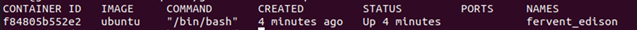

Con il comando docker ps invece vedrò solo i docker attivi

#### Container in stato “running”
-	Se voglio lanciare un comando su un container in stato “running” ma io sono fuori dal container posso usare il comando docker exec, esempio:
```bash
docker exec -it fervent_edison /bin/bash
```
## Creazione dei container, alcuni comandi fondamenti:
- Il comando **start** avvia un container in stato *stopped*
- Il comando **stop** arresta un container in stato *started* ( non si perde il contenuto del file system )
- Il comando **restart** riavvia un Container ( non si perde il contenuto del file system )
- Il comando **pause** mette in pausa il container  ( non si perde il contenuto del file system e neanche lo stato dei processi )
- Il comando **unpause** rimette in start un container in stato pause

## Informazioni sui comandi docker
```bash
Docker --help
```

## Cancellare i container
```bash
docker rm “nome container/id container”
```
## Comandi exec e attach

Se voglio lanciare un comando dentro un container allora posso usare il comando **exec**, ad esempio:
```bash
docker exec -it “nome container” comando
```
Alcuni esempi:
```bash
docker exec -it fervent_edison ls
docker exec -it fervent_edison /bin/bash
```
Se invece voglio entrare nell’entry point già creato del container in stato running posso utilizzare il comando **attach**, come
```bash
Docker attach “nome container”
```
Per essere precisi attach (docker attach) servono per collegare stdin,stderr e stdout della macchina locale sul container

## Salvataggio File sui container
Se io salvo un file su un container, il file rimarrà nel suo file system anche se il container è in stato Exited.

## Visualizziamo i log di un container

```bash
Docker logs “nome container”
```
Posso vedere l’ultimo “print” stampato dal container anche se è in stato stopped

## Eliminare o stoppare in maniera massiva i container

1. Elimiare tutti i container docker ( se possibile )
1. Elimiare tutti i container docker ( se possibile )

```bash
Docker rm $(docker ps -a -q)
```
Infatti, questo comando serve per eliminare un container:
**Docker rm** mentre, **$(docker ps -a -q)** mi da una lista di tutti i container presenti.
Quindi il risultato sarà eliminare tutti i container presenti.

**[Attenzione]** Se un container è in stato **run** questo non sarà eliminato da Docker

2.  Si possono fare anche eliminazioni "mirate", ad esempio eliminare tutti i container in stato "exited"

```bash
Docker rm $(docker ps -a -f status=exited -q)
```

3. Eliminare tutte le immagini ( se possible )

2.  Si possono fare anche eliminazioni "mirate", ad esempio eliminare tutti i container in stato "exited"

```bash
Docker rm $(docker ps -a -f status=exited -q)
```

3. Eliminare tutte le immagini ( se possible )

```bash
Docker rmi $(docker ps -a -q)
```


Infatti, questo comando serve per eliminare una immagine:
**Docker rmi** mentre **$(docker images -a -q)** mi da una lista di tutti i container presenti.
Quindi il risultato sarà eliminare tutti i container presenti.

## Networking in Docker

Di default docker crea una interfaccia di rete chiamata Docker0 in bridge ethernet, tutti i container saranno agganciati a quell'interfaccia e
docker engine penserà al routing. 
Viene assegnato al container un ip della subnet definita (di solito 172.17.0.0/16) , questa network essendo in una rete virtuale e confinata dal docker engine potrà:
- Raggiungere l'esterno
- Non potrà essere raggiunta dall'esterno


Se voglio vedere le network in docker:

```bash
docker network ls
```
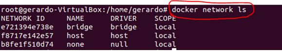

Se voglio vedere i dettagli della rete docker in particolare, posso farlo con il comando **inspect**
con l'id della rete.

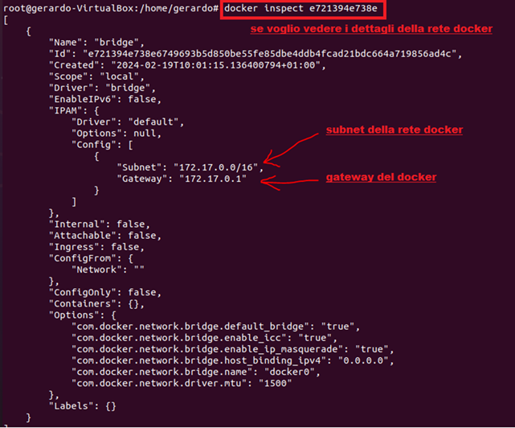

**Nota:**
Anche se è in bridge, la rete docker e la rete fisica sono diverse:

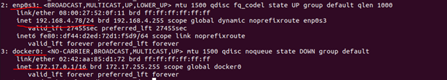

Supponiamo di voler installare Apache per avere un server web:

```bash
Docker pull httpd
Docker run -itd –name: ApacheTest -p 8080:80 httpd
```

Il **parametro -p è fondamentale** perché <u> consente di mappare la porta del rete docker sulla rete locale </u>

Come si vede anche dal docker ps -a nella sezione PORTS, tutto il traffico della rete locale della porta 8080 viene mappata sulla porta 80 del container

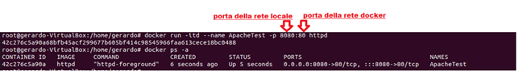

Visto che le 2 reti sono separate ( rete docker e rete fisica ) ho 2 modi per vedere il funzionamento.
La prima è utilizzando la rete docker e la porta 80 e il comando curl

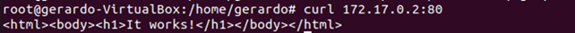

La seconda è utilizzando la rete fisica con la mappatura della porta 8080->80 del container e il comando curl

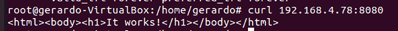

Ovviamente, nel secondo caso si può usare anche l’interfaccia web della rete fisica

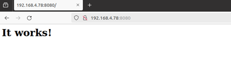

**Di seguito uno schema di quanto fatto:**

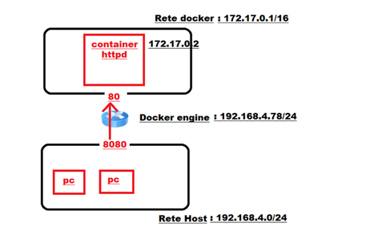

Abbiamo visto che il docker engine crea una separazione tra le 2 reti, quella dei container e la nostra rete fisica. 
Ma come posso fare per avere un container sulla “rete fisica”?

Ci sono 2 possibilità, in base alle necessità:

utilizzando l’opzione **--network host**

utilizzando l’opzione **–network macvlan**

#### Ipotesi 1: 
**--network host** , serve per posizionare il container sul nostro host
Verifichiamolo con il nostro server web Apache

```bash
Docker run -itd --network host –name: ApacheTest1 -p 8080:80 httpd
```

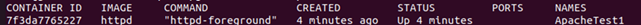

Notiamo che non è presente più nulla nella sezione ports e infatti se faccio curl localhost:80
Posso notare che il container è raggiungibile dalla rete locale, perché esso stesso è sulla rete locale


#### Ipotesi 2 : 
**--network macvlan** 

Se desideriamo invece che il container abbia un indirizzo ip della stessa network dell'host dobbiamo creare un'interfaccia di rete
utilizzando il driver macvlan.
In questa situazione, puoi utilizzare il driver di rete macvlan per assegnare un indirizzo MAC all'interfaccia di rete virtuale di ogni contenitore,
facendo sembrare che sia un'interfaccia di rete fisica direttamente collegata alla rete fisica.
Questo può essere molto utile sopratutto per software legacy, in quanto alcuni programmi vogliono assocciare l'interfaccia di rete fisica direttamente alla rete fisica.


-> Creiamo un rete MACVLAN

In teoria dobbiamo assegnare una rete fuori dalla rete con indirizzi assegnati dal DHCP

```bash
docker network create -d macvlan   --subnet=192.168.4.0/24   --gateway=192.168.4.10  -o parent=”interfaccia di rete” rete_macvlan
docker run -d --network=rete_macvlan --name ApacheTest2 httpd:latest
```

**NOTA=** il docker engine non riuscirà a raggiungere i container sulla rete fisica, solo gli altri host della stessa rete ci riusciranno
**NOTA2=** come nel caso precedente non c’è bisogno del port-forwarding infatti la porta è accessibile direttamente dalla rete fisica

Supponiamo che ora vogliamo assegnare un indirizzo ip fisso al mio container, nel caso seguente assegnerò 192.168.4.1

```bash
docker run -d --network=rete_macvlan –-ip 192.168.4.1 --name ApacheTest3 httpd:latest
```
## Gestione dei dati

Esistono 2 modi per gestire i dati dei container: VOLUME e BIND Mount

VOLUME:

Il metodo consigliato per la persistenza dei dati in generale sono i Named Volume, quando è possibile quindi si consiglia di Volume.
I volumi di default si trovano sulla Macchina host nel seguente percorso: **/var/lib/docker/volumes**
1. Per creare un volume: **docker volume create “nome-volume”**
```bash
Es: docker volume create VolumeTest
```
2. Per vedere i dettagli di un volume: **docker inspect “nome-volume”**
```bash
Es: docker volume inspect VolumeTest
```
3. Per vedere i volumi presenti:  **docker inspect “nome-volume”**
```bash
Es: docker volume ls
```
4. Per eliminare un volume: **docker volume rm “nome-volume”**
```bash
Es: docker volume rm VolumeTest
```
Da un certo punto di vista possiamo pensare ai volumi con ad un di directory, ad esempio:
```bash
docker run -d --name ApacheTest3 -p 8080:80 -v VolumePerApache:/usr/local/apache2/htdocs httpd
```
## BIND MOUNT
Si può usare anche il bind mount, simile al volume ma molto meno flessibile perché ti consente di collegare direttamente un file o directory tra host e container, è un mount tra file, ad esempio
```bash
docker run -d --name ApacheTest3 -p 8080:80 -v ./index.html:/usr/local/apache2/htdocs/index.html httpd
```
dove **./index.html** indica cartella corrente e il file specifico index.html

## Immagine e Build

La creazione di una immagine è un aspetto fondamentale in docker.
Infatti dalle immagine vengono poi generati i container che saranno utilizzati.

Se vogliamo creare nuovi immagini, invece che scaricarle dal registry, ci sono 2 modi
- comando **docker commit** ( a partire da un container esistente )
- Manualmente con un dockerfile ( consigliato )


#### Opzione 1. Usare Docker commit
Docker commit <container> <image >
Crea una immagine nuova a partire da un container esistente ( si può usare anche come backup )
però l’immagine non conterrà i dati dei volumi montati e il container verrà messo in pausa
Supponiamo che voglia congelare il container nginx_test, usiamo:
```bash
docker commit nginx_test nginx_immagine 
```
facendo un docker images, vedo l’immagine creata:

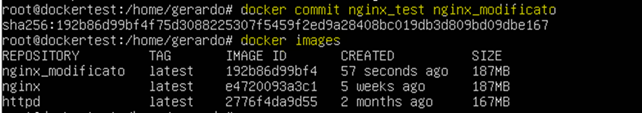

Se faccio un docker run dall’immagine indicata ho il risultato indicato


E se volessi usare questo container in un altro docker engine? 
Posso esportare l’immagine con:
```bash
docker save nginx_modificato > ngnix_modificato.tar
```
Per importarlo in un altro docker engine utilizziamo docker load:
```bash
Docker load < nginx_modificato.tar
```

#### Opzione 2. Usare Dockerfile 

Un Dockerfile è scritto in linguaggio DSL, ovvero un insieme di istruzioni per costruire l’immagine.

**ISTRUZIONE FROM** : E' la più importante: definisce il container (layer di partenza)

**COMMENTI**: Si usa il carattere #

**ENV** : Imposta variabili d'ambiente valide solo per il contesto Dockerfile (durante la build)

Es: ENV nome-variabile=valore

**WORKDIR**: vale solo nel contesto Dockerfile e definisce la directory di lavoro per tutti i comandi successivi come: 

CMD, ENTRYPOINT, COPY E ADD

**RUN**: E' un comando che esegue un comando durante la build e GENERA UN NUOVO LAYER

**ADD** e **COPY**: Aggiungono file all'immagine ma ADD non ha il supporto per i file remoti e gli archivi

**LABEL**: Aggiunge dei metadati (etichette) all'immagine, es: mantainer, o versione (non è legato alla definizione dell'immagine)

**ENTRYPOINT**: Esegue un comando nel container nonappena viene avviato

**EXPOSE**: Si usano per definire quali porte saranno in ascolto in runtime, non apre porte ma prepara il forwarding

**VOLUME**: E' un'etichetta di coume esterno che sarà montato dall'host o dal container, poi quando faremo il run decideremo dove montarlo.

Nota importante: Bisogna cercare di evitare di usare il comando RUN in molti passaggi nel dockerfile, infatti RUN genera un nuovo layer in un container.
Se lo utilizzo n volte, avrà n nuovi layer e quindi in mio container diventerà molto importante a livello di dimensioni.

Supponiamo di avere un dockerfile formattato ad hoc, con i comandi di cui sopra.

Per andare a costruire una immagine a partire dal dockerfile, basta digitare:

```bash
docker build -f "percorso_file" -t “nome immagine:latest”
```
Se invece voglio buildare un dockerfile presente nella cartella corrente:
```bash
docker build . -t “nome immagine:tagversione”
```
Esempio: 

```bash
docker build . “myimage:0.1”
```

Ipotesi di un docker file:

```bash
FROM ubuntu:latest            #Definisce l’immagine di partenza
RUN apt get update			      #Svolge delle operazioni sopra il livello corrente del container
CMD[“echo”,”ciao mondo”]	    #Esegue un comando predefinito del container. Ci può essere un solo comando CMD
```

E supponiamo di voler fare una build di questa immagine con il dockerfile in questa cartella:

```bash
Docker build . prova:0.1
```
Se voglio inviarla su docker hub, basta fare un push

```bash
Docker push ProfiloDocker/NomeImmagine:tag
```
DOCKER COMPOSE:

Se si vuole fare in modo di avviare più container o servizi si può usare **docker compose**:
Ti consente tramite un file *.yaml di avviare una configurazione specifica.

Se sei nella cartella di quel determinato file .yaml allora puoi fare:
```bash
docker compose up  #per attivare tutto
```
Se vuoi avviarlo in modalità detach: 
```bash
docker compose up -d
```
Serve se vuoi arrestare ed eliminare tutti i container, i network e i volumi creati da un file:
```bash
docker compose down 
```
Passiamo a degli esempi pratici, nella cartella EsempiDocker ce ne sono 2 che sottolineano la potenza di questo strumento.
Nella cartella Esempio Wordpress vediamo come è composto il file .yaml

```bash 

services:

  wordpress:
    image: wordpress
    restart: always
    ports:
      - 8080:80
    environment:
      WORDPRESS_DB_HOST: db
      WORDPRESS_DB_USER: exampleuser
      WORDPRESS_DB_PASSWORD: examplepass
      WORDPRESS_DB_NAME: exampledb
    volumes:
      - wordpress:/var/www/html
  db:
    image: mysql:8.0
    restart: always
    environment:
      MYSQL_DATABASE: exampledb
      MYSQL_USER: exampleuser
      MYSQL_PASSWORD: examplepass
      MYSQL_RANDOM_ROOT_PASSWORD: '1'
    volumes:
      - db:/var/lib/mysql

volumes:
  wordpress:
  db:
```

In questo file yaml sono presenti 2 servizi, ovvero sarà fatto il deploy di 2 container
Il servizio Wordpress e il servizio MySql con il comando seguente.
I 2 container saranno lanciato con tutto quello che serve le variabili d'ambiente e i volumi che contengono i dati

```bash
docker compose up -d
```
Un altro esempio ancora più interessante è il caso presente di EsempioMulti.
In questo caso verranno avviati 2 container nginx.


